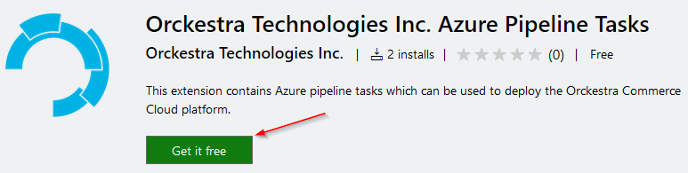

# CommerceModel.BetterRetail

This project contains a sample dataset and related configuration for a retailer called BetterRetail. You can import this dataset in an Orckestra Commerce Cloud platform.

## Getting Started

These instructions will get you a copy of the project up and running on your local machine for development and testing purposes. See deployment for notes on how to deploy the project on a live system.

### Prerequisites

You need to have Visual Studio 2019 installed to build this project. You can download Visual Studio from here [https://visualstudio.microsoft.com/](https://visualstudio.microsoft.com/).

You also need PowerShell 5.1 to execute the build script. The build script it not supported in PowerShell Core.

### Building

> For security reasons, credentials cannot be stored in nuget.config. Instead they are stored in an environment variable called `OrckestraAzureArtifactsPassword`. You will be prompted for its value the first time the build script is executed and you may need to update its value manually should it be modified. You can ask your Orckestra Support Specialist for a the value if you do not already have it.

You can build the project by opening a PowerShell window in the `build` folder and executing this:

```powershell
.\Build.ps1 -t all -ExtraProperties @{ SensitiveData= @{ NewUsersPassword = '<PWD>' ; ShippoApiKey = '<SkippoApiKey>'; TranssmartApiUsername = '<TranssmartApiUsername>'; TranssmartApiPassword = '<TranssmartApiPassword>'; TranssmartAccount = '<TranssmartAccount>'; TranssmartApiEndpoint = '<TranssmartApiEndpoint>'; AvalaraAccountNumber = '<AvalaraAccountNumber>' ; AvalaraCompanyCode = '<AvalaraCompanyCode>' ; AvalaraLicenceKey = '<AvalaraLicenceKey>' ; AvalaraServiceUrl = '<AvalaraServiceUrl>' } }
```

The sensitive information (usernames & passwords) have been scrubbed from the dataset so you will need to fill in the values for the sensitive data at compile time with the values for your providers. `NewUsersPassword` is the only required value and you can omit the other values if you do not use [Shippo](https://goshippo.com/), [Transsmart](https://www.transsmart.com) or [Avalara](https://www.avalara.com).

> [!TIP]
> You can create a file named `build.sensitivedata.json` in the `build` folder to keep that information. This file is ignored by Git so it will not be checked-in Git. The file has the following format:
>
> ```json
> {
>   "NewUsersPassword": "",
>   "ShippoApiKey": "",
>   "TranssmartApiUsername": "",
>   "TranssmartApiPassword": "",
>   "TranssmartAccount": "",
>   "TranssmartApiEndpoint": "",
>   "AvalaraAccountNumber": "",
>   "AvalaraCompanyCode": "",
>   "AvalaraLicenceKey": "",
>   "AvalaraServiceUrl": ""
> }
> ```

### Before doing a Git commit

The build process will modify files which contain sensitive data and you will need to revert the changes to these file before adding the files to Git to prevent sensitive information to be committed to Git. You can run this command to revert the changes to known sensitive files:

```powershell
.\Build.ps1 -t UndoSensitiveData
```

## Deployment

The build script will generate an artifact named `CommerceModel.BetterRetail.*.nupkg`. On a developer workstation this package will be copied to the folder `C:\packages` and in an Azure Pipeline it will be uploaded to Orckestra's Cloud Management platform for deployment on a publicly accessible platform.

### Deployment On A Developer Workstation

> [!NOTE]
> This documentation assumes that you already have an Orckestra Commerce Cloud local installation. Refer to your Orckestra Support Specialist if you need help setting up a local installation.

To use the package you need to add it to your `desired installer` file and redeploy your local installation. You can locate the installer file in the `build` folder of your Orckestra Commerce Cloud local installation, it will be named `Desired_Installer.json`. Open the file in a text editor and add the following code to the end of the packages node:

```json
{
  "Name": "CommerceModel.BetterRetail",
  "Version": "0.0.0",
  "Source": "Local"
}
```

The resulting file should look like this:

```json
{
  "Sources": [
    <<Omitted>>
  ],
  "Installer": {
    "Name": "OrckestraCommerce.Installer",
    "Version": "[4, 99]",
    "Source": "Release"
  },
  "Packages": [
    {
      "Name": "OrckestraCommerce.Core",
      "Version": "4.3.1",
      "Source": "Release"
    },
    {
      "Name": "OrckestraCommerce.Marketing",
      "Version": "4.3.1",
      "Source": "Release"
    },
    {
      "Name": "ClientName.Extensions",
      "Version": "0.0.0",
      "Source": "Local"
    },
    {
      "Name": "ClientName.CommerceModel",
      "Version": "0.0.0",
      "Source": "Local"
    },
    {
        "Name": "CommerceModel.BetterRetail",
        "Version": "0.0.0",
        "Source": "Local"
    }
  ]
}
```

By default, the deployment script `integration.psake.ps1` does not automatically load a dataset and you will need to modify it to load this dataset. You need to do 2 modifications to the script:

1. Uncomment these lines

   ```PowerShell
   #$defaultProfileLoadingActivity = "ClientName.Extensions.LoadDataProfile_DEV, ClientName.Extensions"
   #$Deployment.Input.DataProfileLoadingActivity = SetOrDefault $DataProfileLoadingActivity $defaultProfileLoadingActivity
   ```

1. Modify the function `HandleDataProfileLoading` to add the required `inputs` parameters to `$body`. Refer to `Deployment Using Azure Pipeline` below to have the description of the input parameters. This script uses PowerShell so you have to use PowerShell syntax to add the input parameters like so:

   ```powershell
   $body = @{
       taskId= $taskId
       correlationId= "2A33F666-C8BC-40FE-A8AD-E4156F22428C"
       taskName= "LoadCommerceModelTask"
       activityTypeName= $activity
       inputs= @{
                   DefaultDomainName='XYZ.onmicrosoft.com'
                   SmtpHost = ""
                   SmtpPassword = ""
                   SmtpUserName = ""
                   SmtpPort = @{
                     "value" = 587
                     "__type" = "ValueOfInt32"
                   }
                   SmtpSenderAddress = ""
                   SmtpAllowedReceiverDomainsRegex = ""
                   SmtpDisallowedEmailAddressReceiver = ""
                   AzureDirectoryProviderTempPassword = ""
                 }
       isSequential= $null
       sequenceGroup= $null
       sequenceQuota= $null
   }
   ```

### Deployment Using Azure Pipeline

> [!IMPORTANT]
> You need to install `Orckestra Technologies Inc. Azure Pipeline Tasks` from the Azure DevOps marketplace. You can follow this [link](https://marketplace.visualstudio.com/items?itemName=orckestra-technologies.orckestra-technologies-pipeline-tasks) to install it.
> 

1. Fork this repository on Azure DevOps
   1. Create a new repository on Azure DevOps
   1. Download this repository from GitHub and upload it to the new Azure DevOps repository
   1. Edit the file `build/build-pipeline.yml` and keep only one of the `PublishToCMP` tasks and change its `clientCode` input to `$(CMP.ClientCode)`
1. Create a variable group (in Pipeline/Library) called `CMP - Connection API V2`

   1. This group should have 4 values:

      | Variable       | Value                                      | Comment                                                                         |
      | -------------- | ------------------------------------------ | ------------------------------------------------------------------------------- |
      | CMP.ClientCode |                                            | A short (3 to 5 characters) value to identify your project/client               |
      | CMP.UserName   | svcCmpPipeline`<CLIENTCODE>`@orckestra.com | The service account used to interact with Orckestra's Cloud Management Platform |
      | CMP.Password   |                                            | You should encrypt the password                                                 |
      | CMP.URL        | <https://api.orckestra.cloud>              | URL of Orckestra's Cloud Management Platform                                    |

      Ask your Orckestra Support Specialist for your service account.

1. Create a variable group (in Pipeline/Library) called `BetterRetail Sensitive Data`

   1. This group should have 1 value:

      | Variable      | Value                                                                                                                                                      | Comment                                                                         |
      | ------------- | ---------------------------------------------------------------------------------------------------------------------------------------------------------- | ------------------------------------------------------------------------------- |
      | SensitiveData | @{ NewUsersPassword = '' ; ShippoApiKey = '; TranssmartApiUsername = '; TranssmartApiPassword = '; TranssmartAccount = '; TranssmartApiEndpoint = ''; AvalaraAccountNumber = '' ; AvalaraCompanyCode = '' ; AvalaraLicenceKey = '' ; AvalaraServiceUrl = '' } | A PowerShell formatted Hashtable containing the ExtraProperties's SentitiveData. You can use the value shown on the left and fill in the values. |

      Ask your Orckestra Support Specialist for your service account.

1. Create a new Azure DevOps pipeline based on the file `build/build-pipeline.yml`
1. Execute the newly created pipeline to build the repository and upload the package to Orckestra's Cloud Management Platform
   > [!TIP]
   > You will need to authorize access to the variable group on the first run of the pipeline
1. As with the desired installer of a developer workstation you need to add a reference to the package to your desired state of your release pipeline to deploy the package. You can refer to [this documentation](https://docs.orckestra.com/developer-documentation/getting-started/developer-environment-setup/undersanding-the-project-template) to know how and where to modify your desired state. You will need to select the correct version and source for the package. This information will be present in the output of the pipeline.
1. Importing the BetterRetail commerce model can be achieved by adding the task `Execute Orckestra Commerce Cloud Activity` in your release pipeline. This task is found in the Azure DevOps Extension `Orckestra Technologies Inc. Azure Pipeline Tasks` that was installed before. You will need to input the following parameter in the task:
   |Parameter |Value |Note |
   |---------|---------|---------|
   |Display name | Load Data Profile (BetterRetail) | |
   | OCS Host Name | ocscm.`ENVCODE`.`CLIENTCODE`.orckestra.cloud | Replace `ENVCODE` with your environment code (QA/INT/STG/PRD) and replace `CLIENTCODE` with the short name of your project. |
   | Authentication Token | | The authentication token for your platform. Talk with your Orckestra Support Specialist to obtain it. |
   | Correlation Id | 2A33F666-C8BC-40FE-A8AD-E4156F22428C | A guid value that is used to identity the task in the logs |
   | Task Name | LoadCommerceModelTask | Name of the task to queue |
   | Activity Type Name | CommerceModel.BetterRetail.LoadDataProfile_DevTest, CommerceModel.BetterRetail | The fully qualified class name with assembly of the XAML file to execute. |
   | Task Inputs | <code>{<br> "DefaultDomainName":"XYZ.onmicrosoft.com",<br> "SmtpHost":"",<br> "SmtpPassword":"",<br> "SmtpUserName":"",<br> "SmtpPort": { "value" = 587, "__type" = "ValueOfInt32" },<br> "SmtpSenderAddress":"",<br> "SmtpAllowedReceiverDomainsRegex":"",<br> "SmtpDisallowedEmailAddressReceiver":"",<br> "AzureDirectoryProviderTempPassword":""<br> }</code> | <ul><li>DefaultDomainName: This value will be appended to the username of the users created in CreateUserActivity</li><li>SmtpHost: The address of the SMTP server</li><li>SmtpPassword: The password used to authenticate with the SMTP server</li><li>SmtpUserName: The usernameused to authenticate with the SMTP server</li><li>SmtpPort: The port of the SMTP server. Modern services, like SendGrid, uses port 587 for SSL instead of port 25</li><li>SmtpSenderAddress: The email address used as the sender for the emails</li><liSmtpAllowedReceiverDomainsRegex: Optional parameter. When used, the email addresses are validated using it.</li><li>SmtpDisallowedEmailAddressReceiver: Optional parameter. When an email is invalid because of `SmtpAllowedReceiverDomainsRegex` it will be replaced by the value from `SmtpDisallowedEmailAddressReceiver`</li><li>AzureDirectoryProviderTempPassword: The default password to use when resetting a user's password</li></ul> |

## Built With

- [psake](https://github.com/psake/psake)
- [Carbon](http://get-carbon.org/)

## Versioning

For the versions available, see the [tags on this repository](https://github.com/Orckestra/CommerceModel.BetterRetail/tags).

## License

This project is licensed under the MIT License - see the [LICENSE](LICENSE) file for details
